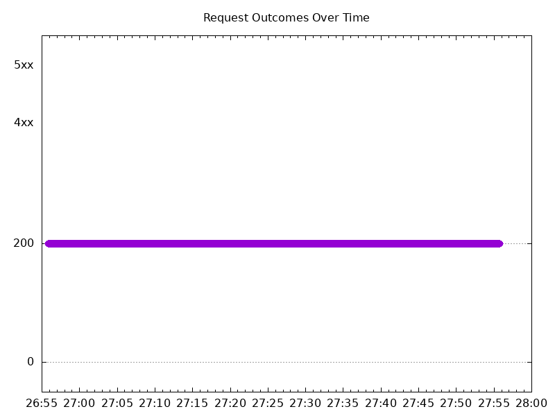

# Results

## Test environment

NGINX Plus: true

GKE Cluster:

- Node count: 12
- k8s version: v1.29.5-gke.1091002
- vCPUs per node: 16
- RAM per node: 65855012Ki
- Max pods per node: 110
- Zone: us-west1-b
- Instance Type: n2d-standard-16

## Test: Send http /coffee traffic

```text
Requests      [total, rate, throughput]         6000, 100.02, 100.02
Duration      [total, attack, wait]             59.991s, 59.99s, 983.001µs
Latencies     [min, mean, 50, 90, 95, 99, max]  726.204µs, 1.034ms, 1.008ms, 1.155ms, 1.216ms, 1.411ms, 12.302ms
Bytes In      [total, mean]                     954000, 159.00
Bytes Out     [total, mean]                     0, 0.00
Success       [ratio]                           100.00%
Status Codes  [code:count]                      200:6000  
Error Set:
```



## Test: Send https /tea traffic

```text
Requests      [total, rate, throughput]         6000, 100.02, 100.02
Duration      [total, attack, wait]             59.991s, 59.99s, 1.081ms
Latencies     [min, mean, 50, 90, 95, 99, max]  764.615µs, 1.034ms, 1.006ms, 1.141ms, 1.197ms, 1.363ms, 12.276ms
Bytes In      [total, mean]                     912000, 152.00
Bytes Out     [total, mean]                     0, 0.00
Success       [ratio]                           100.00%
Status Codes  [code:count]                      200:6000  
Error Set:
```


